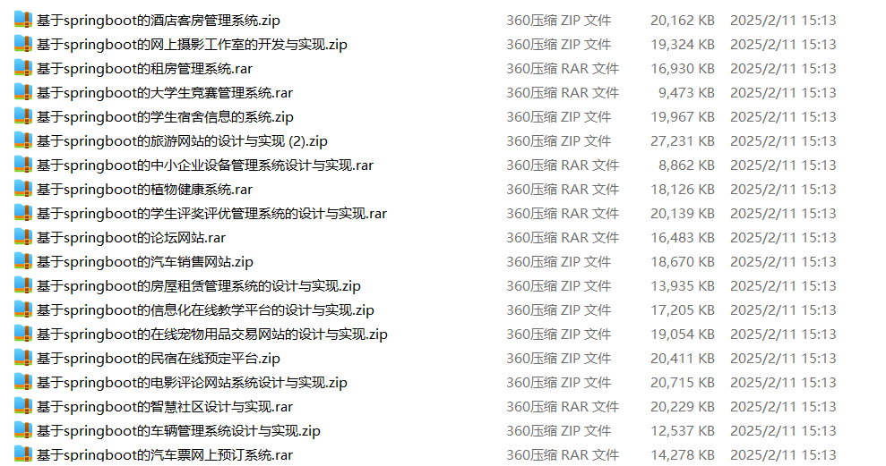

# springboot_campus_recruitment_volunteer_sports_meet

📦 SpringBoot多功能项目仓库 🎯

本仓库汇集了三个基于 **Spring Boot** 开发的高实用性项目，涵盖**校园招聘管理**、**志愿者管理**、**校运会赛事管理**等多个领域，适用于**高校就业中心**、**志愿者组织**、**体育赛事组委会**，助力提升**校园就业**、**志愿活动**、**运动会管理**的效率，为校园提供智能化解决方案！🚀

💼 **校园招聘系统** —— 提供**职位发布**、**简历投递**、**面试安排**、**录用通知**等功能，优化**校园求职招聘流程**，适用于**高校就业中心**、**企业校园招聘** 📄✅

🤝 **校园志愿者管理系统** —— 具备**志愿活动发布**、**报名审核**、**志愿者考核**、**服务时长记录**等功能，助力校园**志愿活动组织与管理**，适用于**公益组织**、**志愿者协会** 💖🎗️

🏆 **校运会管理系统** —— 提供**赛事组织**、**运动员报名**、**比赛安排**、**成绩统计**等功能，助力**体育赛事管理**，适用于**高校体育组**、**运动会组委会** 🏅🏃‍♂️

**项目部署说明**✨：

推荐使用：**谷歌浏览器**

**后台地址**😎

http://localhost:8080/springboot/admin/dist/index.html

**前台地址**😎

http://localhost:8080/springboot/front/index.html

在**src\main\resources\application.yml中**编辑数据库配置🎉										
url:jdbc:mysql://127.0.0.1:3306/springbootuseUnicode=true&characterEncoding=utf8&useJDBCCompliantTimezoneShift=true&useLegacyDatetimeCode=false&serverTimezone=UTC
username: root
password: 123456

**文档预览**👀

**其他项目合集**✨

